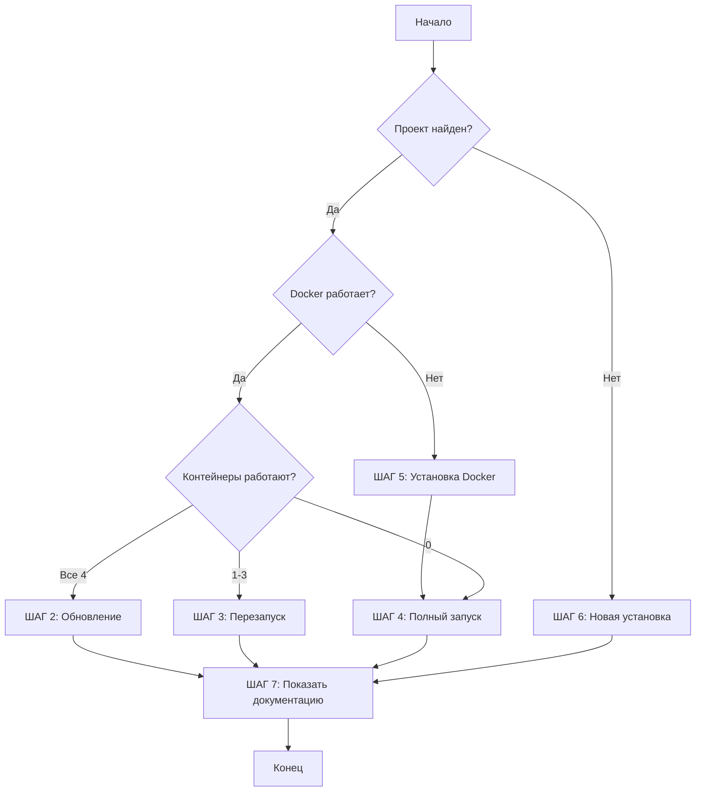

# Инструкция для AI: Обновление PLGames Board на сервере

**Для:** Qwen Coder Plus или другого AI-ассистента на сервере uwow-guide.online
**Цель:** Проверить состояние, скачать обновления, исправить проблемы

---

## 📋 ШАГ 1: Проверка текущего состояния

### 1.1. Определи где находится проект

```bash
# Проверь возможные расположения
if [ -d "/opt/plgames" ]; then
    PROJECT_DIR="/opt/plgames"
    echo "✓ Проект найден в /opt/plgames"
elif [ -d "/home/plgames/boards_plane" ]; then
    PROJECT_DIR="/home/plgames/boards_plane"
    echo "✓ Проект найден в /home/plgames/boards_plane"
elif [ -d "$HOME/boards_plane" ]; then
    PROJECT_DIR="$HOME/boards_plane"
    echo "✓ Проект найден в $HOME/boards_plane"
else
    echo "✗ Проект НЕ найден"
    PROJECT_DIR=""
fi

echo "PROJECT_DIR=$PROJECT_DIR"
```

**Результат:**
- Если проект найден → переходи к шагу 1.2
- Если НЕ найден → переходи к [ШАГ 6: Новая установка](#-шаг-6-новая-установка-если-проект-не-найден)

### 1.2. Проверь что Docker работает

```bash
# Проверь Docker
if command -v docker &> /dev/null; then
    echo "✓ Docker установлен: $(docker --version)"

    # Проверь что Docker запущен
    if docker ps &> /dev/null; then
        echo "✓ Docker работает"
        DOCKER_OK=true
    else
        echo "✗ Docker не запущен, пытаюсь запустить..."
        sudo systemctl start docker
        sleep 3
        if docker ps &> /dev/null; then
            echo "✓ Docker запущен"
            DOCKER_OK=true
        else
            echo "✗ Docker не работает"
            DOCKER_OK=false
        fi
    fi
else
    echo "✗ Docker НЕ установлен"
    DOCKER_OK=false
fi
```

**Результат:**
- `DOCKER_OK=true` → переходи к шагу 1.3
- `DOCKER_OK=false` → переходи к [ШАГ 5: Установка Docker](#-шаг-5-установка-docker-если-нет)

### 1.3. Проверь состояние контейнеров

```bash
cd "$PROJECT_DIR"

# Проверь какие контейнеры запущены
echo "=== Статус контейнеров ==="
docker compose ps

# Сохрани статус
CONTAINERS_RUNNING=$(docker compose ps --status running | grep -c "Up" || echo "0")
echo "Запущено контейнеров: $CONTAINERS_RUNNING"
```

**Анализ результата:**

| Ситуация | Что делать |
|----------|-----------|
| Все 4 контейнера `Up` | ✅ Всё работает → ШАГ 2 (обновление) |
| 1-3 контейнера `Up` | ⚠️ Частично работает → ШАГ 3 (перезапуск) |
| 0 контейнеров | ❌ Не работает → ШАГ 4 (полный запуск) |

### 1.4. Проверь работает ли backend

```bash
# Проверь что backend отвечает
if curl -s http://localhost:3010/graphql &> /dev/null; then
    echo "✓ Backend работает (порт 3010)"
    BACKEND_OK=true
else
    echo "✗ Backend НЕ отвечает"
    BACKEND_OK=false
fi

# Проверь логи backend на ошибки
if [ "$BACKEND_OK" = false ]; then
    echo "=== Последние ошибки backend ==="
    docker compose logs backend --tail=20 | grep -E "ERROR|FATAL|Error"
fi
```

---

## 📥 ШАГ 2: Скачивание обновлений (если всё работает)

**Условие:** Контейнеры работают, backend отвечает.

### 2.1. Сделай backup конфигурации

```bash
cd "$PROJECT_DIR"

# Сохрани текущий .env
if [ -f ".env" ]; then
    cp .env .env.backup.$(date +%Y%m%d_%H%M%S)
    echo "✓ Backup конфигурации создан"
fi

# Сохрани текущую версию
git log -1 --oneline > .git_version_before
```

### 2.2. Скачай обновления с GitHub

```bash
cd "$PROJECT_DIR"

echo "=== Скачиваю обновления ==="

# Проверь что есть изменения
git fetch origin main

LOCAL=$(git rev-parse HEAD)
REMOTE=$(git rev-parse origin/main)

if [ "$LOCAL" = "$REMOTE" ]; then
    echo "✓ Проект уже актуален, обновления не требуются"
    exit 0
else
    echo "⚠ Доступны обновления"

    # Покажи что изменилось
    echo "=== Что изменилось ==="
    git log --oneline HEAD..origin/main

    # Скачай изменения
    git pull origin main

    # Обнови submodules (если есть)
    git submodule update --init --recursive

    echo "✓ Обновления скачаны"
fi
```

### 2.3. Проверь нужно ли пересобирать

```bash
cd "$PROJECT_DIR"

# Проверь изменились ли Dockerfile или package.json
REBUILD_NEEDED=false

if git diff HEAD@{1} HEAD --name-only | grep -E "Dockerfile|package.json|docker-compose"; then
    echo "⚠ Обнаружены изменения в Docker конфигурации"
    REBUILD_NEEDED=true
fi

echo "REBUILD_NEEDED=$REBUILD_NEEDED"
```

### 2.4. Примени обновления

```bash
cd "$PROJECT_DIR"

if [ "$REBUILD_NEEDED" = true ]; then
    echo "=== Пересборка образов ==="

    # Останови контейнеры
    docker compose down

    # Пересобери
    docker compose build --no-cache

    # Запусти
    docker compose up -d

    echo "✓ Образы пересобраны и запущены"
else
    echo "=== Перезапуск без пересборки ==="

    # Просто перезапусти с новым кодом
    docker compose down
    docker compose up -d

    echo "✓ Контейнеры перезапущены"
fi
```

### 2.5. Проверь миграции

```bash
cd "$PROJECT_DIR"

echo "=== Проверка миграций ==="

# Подожди пока PostgreSQL будет готов
sleep 15

# Выполни миграции (если есть новые)
docker compose exec backend sh -c "npx prisma migrate deploy" || {
    echo "⚠ Миграции не выполнены, возможно backend еще не готов"
    sleep 15
    docker compose exec backend sh -c "npx prisma migrate deploy"
}

echo "✓ Миграции проверены"
```

### 2.6. Проверь что всё работает

```bash
cd "$PROJECT_DIR"

echo "=== Финальная проверка ==="

# Подожди 30 секунд
sleep 30

# Проверь статус
docker compose ps

# Проверь backend
if curl -s http://localhost:3010/graphql &> /dev/null; then
    echo "✓ Backend работает"
else
    echo "✗ Backend НЕ работает, смотри логи:"
    docker compose logs backend --tail=50
fi

# Проверь frontend
if curl -s http://localhost:8080 &> /dev/null; then
    echo "✓ Frontend работает"
else
    echo "⚠ Frontend может быть не готов"
fi

echo ""
echo "🎉 Обновление завершено!"
```

---

## 🔄 ШАГ 3: Перезапуск (если частично работает)

**Условие:** Часть контейнеров работает, часть нет.

```bash
cd "$PROJECT_DIR"

echo "=== Перезапуск всех сервисов ==="

# Останови всё
docker compose down

# Проверь что остановилось
docker ps | grep plgames || echo "Всё остановлено"

# Запусти снова
docker compose up -d

# Подожди инициализации
echo "Ожидание запуска (30 секунд)..."
sleep 30

# Проверь статус
docker compose ps

# Проверь логи
echo "=== Логи backend ==="
docker compose logs backend --tail=30

# Выполни миграции на всякий случай
docker compose exec backend sh -c "npx prisma migrate deploy" 2>/dev/null || echo "Миграции не требуются"

echo "✓ Перезапуск завершен"
```

---

## 🚀 ШАГ 4: Полный запуск (если ничего не работает)

**Условие:** Контейнеры остановлены или не существуют.

```bash
cd "$PROJECT_DIR"

echo "=== Полный запуск системы ==="

# Проверь что .env существует
if [ ! -f ".env" ]; then
    echo "✗ Файл .env не найден!"

    if [ -f ".env.example" ]; then
        echo "Копирую .env.example в .env"
        cp .env.example .env
        echo "⚠ ВАЖНО: Отредактируй .env перед продолжением!"
        echo "Нужно указать: DOMAIN, DB_PASSWORD"
        exit 1
    else
        echo "✗ .env.example тоже не найден!"
        exit 1
    fi
fi

# Останови старые контейнеры (если есть)
docker compose down 2>/dev/null || true

# Собери образы
echo "=== Сборка образов (10-20 минут) ==="
docker compose build --no-cache

# Запусти
echo "=== Запуск контейнеров ==="
docker compose up -d

# Ожидание PostgreSQL
echo "=== Ожидание PostgreSQL (30 секунд) ==="
sleep 30

# Проверка PostgreSQL
for i in {1..10}; do
    if docker compose exec postgres pg_isready -U plgames &>/dev/null; then
        echo "✓ PostgreSQL готов"
        break
    fi
    echo "Попытка $i/10..."
    sleep 3
done

# Миграции
echo "=== Выполнение миграций ==="
docker compose exec backend sh -c "npx prisma migrate deploy" || {
    echo "⚠ Ошибка миграций, пробую через run..."
    docker compose run --rm backend sh -c "npx prisma migrate deploy"
}

# Финальная проверка
echo "=== Проверка работы ==="
sleep 10

docker compose ps
curl -I http://localhost:3010/graphql
curl -I http://localhost:8080

echo "✓ Полный запуск завершен"
```

---

## 🐳 ШАГ 5: Установка Docker (если нет)

**Условие:** Docker не установлен.

```bash
echo "=== Установка Docker ==="

# Удали старые версии
sudo apt-get remove -y docker docker-engine docker.io containerd runc 2>/dev/null || true

# Обнови систему
sudo apt-get update

# Установи зависимости
sudo apt-get install -y ca-certificates curl gnupg lsb-release

# Добавь репозиторий
curl -fsSL https://download.docker.com/linux/ubuntu/gpg | sudo gpg --dearmor -o /usr/share/keyrings/docker-archive-keyring.gpg

echo "deb [arch=$(dpkg --print-architecture) signed-by=/usr/share/keyrings/docker-archive-keyring.gpg] https://download.docker.com/linux/ubuntu $(lsb_release -cs) stable" | sudo tee /etc/apt/sources.list.d/docker.list > /dev/null

# Установи Docker
sudo apt-get update
sudo apt-get install -y docker-ce docker-ce-cli containerd.io docker-compose-plugin

# Запусти Docker
sudo systemctl start docker
sudo systemctl enable docker

# Проверь
docker --version
docker compose version

echo "✓ Docker установлен"

# Теперь вернись к ШАГ 4
```

---

## 🆕 ШАГ 6: Новая установка (если проект не найден)

**Условие:** Проект не найден на сервере.

```bash
echo "=== Новая установка PLGames Board ==="

# Используй автоматический установщик
curl -fsSL https://raw.githubusercontent.com/Leonid1095/boards_plane/main/install.sh | sudo bash

# Или ручная установка:

# 1. Создай директорию
sudo mkdir -p /opt/plgames
cd /opt/plgames

# 2. Клонируй проект
sudo git clone --recurse-submodules https://github.com/Leonid1095/boards_plane.git .

# 3. Создай .env
sudo cp .env.example .env

# 4. Отредактируй .env
echo "⚠ ВАЖНО: Отредактируй /opt/plgames/.env"
echo "Укажи DOMAIN и DB_PASSWORD"

# 5. Запусти
cd /opt/plgames
sudo docker compose up -d

# 6. Миграции
sleep 30
sudo docker compose exec backend sh -c "npx prisma migrate deploy"

echo "✓ Новая установка завершена"
```

---

## 📖 ШАГ 7: Покажи пользователю документацию

После любого из шагов выше, покажи пользователю:

```bash
echo ""
echo "━━━━━━━━━━━━━━━━━━━━━━━━━━━━━━━━━━━━━━━━━"
echo "  PLGames Board - Статус"
echo "━━━━━━━━━━━━━━━━━━━━━━━━━━━━━━━━━━━━━━━━━"
echo ""

# Покажи статус
cd "$PROJECT_DIR"
docker compose ps

echo ""
echo "📚 Документация доступна здесь:"
echo ""
echo "  📖 Полная инструкция:"
echo "     https://github.com/Leonid1095/boards_plane/blob/main/INSTALL.md"
echo ""
echo "  🎯 Краткий обзор:"
echo "     https://github.com/Leonid1095/boards_plane/blob/main/README.md"
echo ""
echo "  📝 История изменений:"
echo "     https://github.com/Leonid1095/boards_plane/blob/main/CHANGELOG.md"
echo ""

# Доступ к сайту
if curl -s http://localhost:8080 &> /dev/null; then
    echo "✅ Сайт работает:"
    echo "   Frontend: http://$(curl -s ifconfig.me):8080"
    echo "   Backend:  http://$(curl -s ifconfig.me):3010"
    echo "   GraphQL:  http://$(curl -s ifconfig.me):3010/graphql"
else
    echo "⚠️  Сайт еще не готов, подожди 1-2 минуты"
fi

echo ""
echo "━━━━━━━━━━━━━━━━━━━━━━━━━━━━━━━━━━━━━━━━━"
```

---

## 🎯 Алгоритм принятия решений для AI



---

## 📋 Чеклист для AI

При выполнении проверь по порядку:

- [ ] Нашел где находится проект (PROJECT_DIR)
- [ ] Проверил что Docker установлен и работает
- [ ] Проверил статус контейнеров
- [ ] Проверил что backend отвечает на порту 3010
- [ ] Сделал backup .env перед обновлением (если обновляешь)
- [ ] Скачал обновления с GitHub
- [ ] Определил нужна ли пересборка образов
- [ ] Выполнил миграции после обновления
- [ ] Проверил что все контейнеры запущены
- [ ] Проверил логи на ошибки
- [ ] Показал пользователю статус и ссылки на документацию

---

## 🚨 Частые проблемы и решения

### Проблема 1: Backend не запускается

```bash
# Смотри логи
docker compose logs backend --tail=100

# Пересобери backend
docker compose down
docker compose build --no-cache backend
docker compose up -d

# Проверь миграции
docker compose exec backend sh -c "npx prisma migrate deploy"
```

### Проблема 2: "Project not found" при git pull

```bash
# Пересоздай git
cd "$PROJECT_DIR"
rm -rf .git
git init
git remote add origin https://github.com/Leonid1095/boards_plane.git
git fetch
git checkout -b main origin/main
git submodule update --init --recursive
```

### Проблема 3: Порты заняты

```bash
# Найди что занимает порты
sudo lsof -i :3010
sudo lsof -i :8080

# Останови старые процессы
sudo systemctl stop plgames 2>/dev/null || true
docker ps -a | grep plgames | awk '{print $1}' | xargs docker rm -f 2>/dev/null || true
```

---

## 💡 Советы для AI

1. **Всегда проверяй текущее состояние** перед действиями
2. **Делай backup** перед обновлением
3. **Показывай прогресс** пользователю (echo сообщения)
4. **Проверяй результат** после каждого шага
5. **Сохраняй логи** если что-то пошло не так
6. **Не удаляй данные** без подтверждения пользователя
7. **В конце показывай ссылки** на документацию

---

**Последнее обновление:** 2024-12-02
**Версия:** 1.0.0
